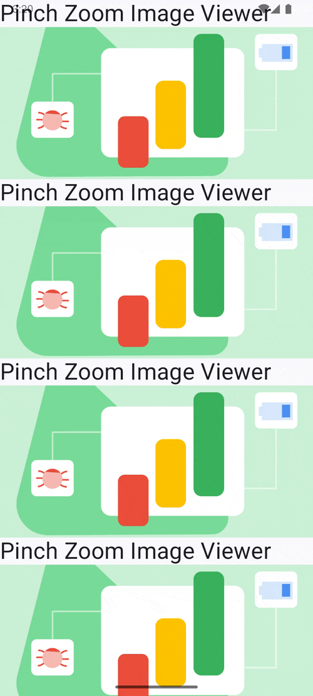

# 핀치 줌 이미지 뷰어



## 준비

## 라이브러리 다운

라이브러리를 다운받아 프로젝트에 추가 하기
https://github.com/sarang628/pinchzoom

## 이미지 로드 라이브러리 설정

coil glide와 같은 이미지 라이브러리를 설정

```
implementation("io.coil-kt:coil-compose:2.6.0")
```

## 사용법 (인스타그램 st 핀치 줌)

```
@Composable
fun PinchZoomImageBoxSample(modifier : Modifier = Modifier){

    // Data shared between a zoomed image and the rest of the list when zooming.
    var zoomState by remember { mutableStateOf<PinchZoomState?>(null) }

    Log.d("__PinchZoomImageBoxSample", "recomposition")

    // pinch zoom custom image loader
    val pinchZoomImageLoader : PinchZoomImageLoader = @Composable {
        AsyncImage(
            modifier = it.modifier
                .height(200.dp)
                .pinchZoomAndTransform(zoomState) {
                    zoomState = it // emit active zoom
                },
            model = it.model,
            contentDescription = it.contentDescription
        )
    }

    PinchZoomImageBox(
        modifier = modifier,
        activeZoomState = zoomState,
        imageLoader = imageLoader
    ){
        LazyColumn(
            verticalArrangement = Arrangement.spacedBy(8.dp),
            // scrollEnabled는 derivedStateOf로 wrapping → recomposition 방지
            userScrollEnabled = remember(zoomState) { zoomState == null }
        ) {
            items(10) {
                Column {
                    pinchZoomImageLoader(
                        PunchZoomImageData(
                            model = "https://blogger.googleusercontent.com/img/b/R29vZ2xl/AVvXsEhkYTY17vrtw3-dlooIu9n7R7mYFgOwyiCwEtJiFJTuxk4sOCKJ-OVaftSPKX7CfONCn2AMMV70TNP9qfo5avZBaMBn4BGS5DW6wPlbRY2ZZRgBXMEI5HbzduVdwj790uDattXfmQtkE8JJ_OptUUDFpCdJZWKVO_mOuL408H4svVQlt58TcjQe8JWfC5g/s1600/app-quality-performance-play-console-insights-meta.png",
                            contentDescription = null
                        )
                    )
                }
            }
        }
    }
}
```

## 코드 설명

### zoomState
- 핀치 줌을 했을 때 변경되는 데이터
- 바깥 이미지에 데이터를 공유한다.

### pinchZoomImageLoader
- 핀치 줌 기능을 제공하는 이미지 로더

### PinchZoomImageBox
- zoomState, 이미지 로더를 설정하면 바깥에 줌 이미지를 표시해 줌.


```kotlin
/**
 * 핀치줌 라이브라리 제공용 이미지 로더
 */
fun coilAsyncImageLoader(): ImageLoader {
    return { modifier, url, contentScale ->
        AsyncImage(
            modifier = modifier,
            model = url,
            contentDescription = null,
            contentScale = contentScale ?: ContentScale.Fit
        )
    }
}
```

### PinchZoomImageBox

핀치줌 시 화면 밖에 확대된 이미지가 나오도록 해주는 Layout
PinchZoomImageBox 호출 시 pinchZoomableImage, zoomState를 제공하는데 !!pinchZoomableImage!!로 이미지를 로드해야 함 주의.

```kotlin
PinchZoomImageBox(imageLoader = coilAsyncImageLoader())
{ pinchZoomableImage, // 이 이미지 로더를 사용해서 이미지를 로드 해야. 줌 기능과 바깥에 이미지가 확대되는 기능이 적용됨.
  zoomState ->

}
```